# RDB 설계
기본 규칙: 모든 이름은 `snake_case` 방식을 사용 

## 1. `PRIMARY KEY`
- 단일 PK의 경우 필드명은 `id`를 사용 (가급적 `SEQUENCE` 사용 권장)
- 복합 PK의 경우 필드명 ... TBD

## 2. `FOREIGN KEY`
```sql
    ...
    FOREIGN KEY (member_id) REFERENCES member(id),
    ...
```
- 외례키로 사용할 필드명은 참조할 `테이블명`과 `_id`를 조합하여 사용
- 규칙 위반 시 tester 모듈(junit test)을 수정해야 함

## 3. `CHECK` 제약조건
```sql
    ...
    CONSTRAINT comments_status_check
        CHECK (status IN ('approved', 'inappropriate')),
    ...
```
- 내부적으로 값을 강제하는 `CHECK` 제약 사용 금지
- 값이 변하거나 추가될 경우 설계 자체가 근본적으로 흔들릴 수 있음

## 4. 샘플 ERD (쇼핑몰)

```mermaid
erDiagram
    member ||--o{ shopping_cart : "소유 (member_id)"
    member ||--o{ purchase : "주문 (member_id)"
    member ||--o{ purchase_history : "기록 (member_id)"
    member ||--o{ comment : "작성 (member_id)"
    
    manager ||--o{ comment : "검토 (manager_id)"
    
    brand ||--o{ product : "제조 (brand_id)"
    category ||--o{ product : "분류 (category_id)"
    
    product ||--o{ cart_item : "포함 (product_id)"
    product ||--o{ order_detail : "포함 (product_id)"
    product ||--o{ product_discount : "적용 (product_id)"
    product ||--o{ comment : "대상 (product_id)"
    
    shopping_cart ||--o{ cart_item : "포함 (shopping_cart_id)"
    purchase ||--o{ order_detail : "상세 (purchase_id)"
    purchase ||--o{ purchase_history : "기록참조 (purchase_id)"
    shipping_info ||--o{ purchase : "배송참조 (shipping_info_id)"
    discount ||--o{ product_discount : "할인참조 (discount_id)"

    member {
        integer id PK "사용자의 고유 식별자"
        varchar username "사용자 계정 이름"
        varchar password "비밀번호 자격 증명"
        varchar name "사용자의 이름"
        varchar email "고유한 이메일 주소"
        varchar contact_number "연락처 전화번호"
        varchar street "도로명 주소"
        varchar city "도시"
        varchar state "주 또는 도"
        varchar postal_code "우편번호"
        varchar country "국가"
        timestamp created_at
        timestamp updated_at
        varchar created_by
        varchar updated_by
    }

    manager {
        integer id PK "관리자의 고유 식별자"
        varchar username "관리자 계정 이름"
        varchar password "비밀번호 자격 증명"
        varchar email "고유한 이메일 주소"
        timestamp created_at
        timestamp updated_at
        varchar created_by
        varchar updated_by
    }

    category {
        integer id PK "카테고리의 고유 식별자"
        varchar name "상품 카테고리의 고유 이름"
        timestamp created_at
        timestamp updated_at
        varchar created_by
        varchar updated_by
    }

    brand {
        integer id PK "브랜드의 고유 식별자"
        varchar name "브랜드의 고유 이름"
        varchar status "브랜드 상태"
        timestamp created_at
        timestamp updated_at
        varchar created_by
        varchar updated_by
    }

    product {
        integer id PK "상품의 고유 식별자"
        varchar name "상품의 이름"
        text description "상품 상세 설명"
        decimal price "상품 현재 단가"
        integer stock "재고 수량"
        integer category_id FK "카테고리 ID"
        integer brand_id FK "브랜드 ID"
        varchar status "상품 상태"
        timestamp created_at
        timestamp updated_at
        varchar created_by
        varchar updated_by
    }

    shipping_info {
        integer id PK "배송 정보의 고유 식별자"
        varchar tracking_number "배송 추적 번호"
        varchar carrier "배송 업체 이름"
        date shipping_date "발송 날짜"
        date delivery_date "배송 완료 날짜"
        varchar status "배송 상태"
        timestamp created_at
        timestamp updated_at
        varchar created_by
        varchar updated_by
    }

    purchase {
        integer id PK "주문의 고유 식별자"
        integer member_id FK "주문 고객 ID"
        timestamp order_date "주문 일시"
        varchar status "주문 상태"
        decimal total_amount "총 결제 금액"
        integer shipping_info_id FK "배송 정보 ID"
        timestamp created_at
        timestamp updated_at
        varchar created_by
        varchar updated_by
    }

    order_detail {
        integer id PK "주문 상세 품목 고유 ID"
        integer purchase_id FK "주문 ID"
        integer product_id FK "상품 ID"
        integer quantity "주문 수량"
        decimal price "주문 당시 단가"
        timestamp created_at
        timestamp updated_at
        varchar created_by
        varchar updated_by
    }

    shopping_cart {
        integer id PK "장바구니 고유 ID"
        integer member_id FK "장바구니 소유자 ID"
        timestamp created_at
        timestamp updated_at
        varchar created_by
        varchar updated_by
    }

    cart_item {
        integer id PK "장바구니 품목 고유 ID"
        integer shopping_cart_id FK "장바구니 ID"
        integer product_id FK "상품 ID"
        integer quantity "담은 수량"
        timestamp created_at
        timestamp updated_at
        varchar created_by
        varchar updated_by
    }

    purchase_history {
        integer id PK "구매 이력 고유 ID"
        integer member_id FK "사용자 ID"
        integer purchase_id FK "주문 ID"
        timestamp purchase_date "구매 이력 생성 일시"
        timestamp created_at
        timestamp updated_at
        varchar created_by
        varchar updated_by
    }

    comment {
        integer id PK "댓글 고유 ID"
        integer product_id FK "상품 ID"
        integer member_id FK "사용자 ID"
        text comment "댓글 텍스트 내용"
        timestamp comment_date "댓글 제출 일시"
        varchar status "검토 상태"
        integer manager_id FK "검토 관리자 ID"
        timestamp created_at
        timestamp updated_at
        varchar created_by
        varchar updated_by
    }

    discount {
        integer id PK "할인 고유 ID"
        varchar name "할인 이름"
        text description "할인 설명"
        decimal discount_percentage "할인율"
        date start_date "할인 시작일"
        date end_date "할인 만료일"
        timestamp created_at
        timestamp updated_at
        varchar created_by
        varchar updated_by
    }

    product_discount {
        integer id PK "상품-할인 연결 고유 ID"
        integer product_id FK "상품 ID"
        integer discount_id FK "할인 ID"
        timestamp created_at
        timestamp updated_at
        varchar created_by
        varchar updated_by
    }
```

